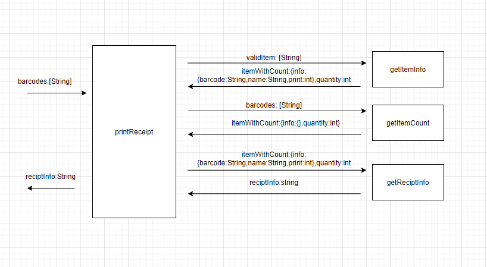

## Tasking

1.统计相同商品分别有几个

* 输入：barcodes：[String]
* 输出：itemWithCount： {info:{},quantity:int}

2.收集商品信息

* 输入：validItem： [String]
* 输出：itemWithCount:  {info:{barcode:String,name:String,price:int},quantity:int}

3.格式化数据

* 输入：itemWithCount:  {info:{barcode:String,name:String,price:int},quantity:int}
* 输出：reciptInfo:String

4.输出数据

* 输入：barcodes: [String]
* 输出：reciptInfo:String

| | printReceipt |   
-|-|-
plan | 10min |
Do | 15min |
Check | 对js语法不够熟练 | 
Action | 多多练习js编程，熟练js语法 |

| | getItemCount |   
-|-|-
plan | 15min |
Do | 30min |
Check | 对对象元素遍历还是不够熟练 | 
Action | 加强对js基础知识的回顾以及js对象遍历、赋值、循环等知识点的学习 |

| | getItemInfo |   
-|-|-
plan | 15min |
Do | 30min |
Check | 花费较长时间整体思路，书写代码。 | 
Action | 平时加强对代码的练习，形成比较快的应激反应。平时多练习js一些对象函数的使用 |

| | getReceiptInfo |   
-|-|-
plan | 15min |
Do | 20min |
Check | 刚开始先使用console.log逐行打印数据，出现字符串匹配不上问题 | 
Action | 在之后的练习中培养字符串整体拼接之后统一输出的习惯 |
